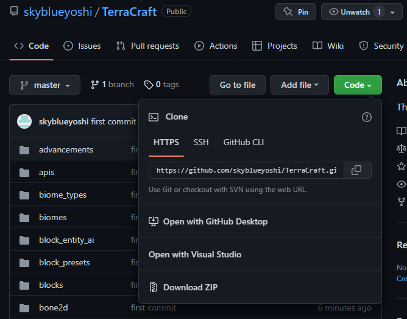
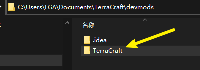
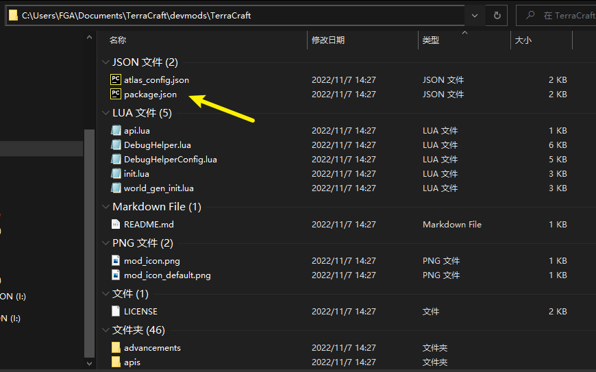
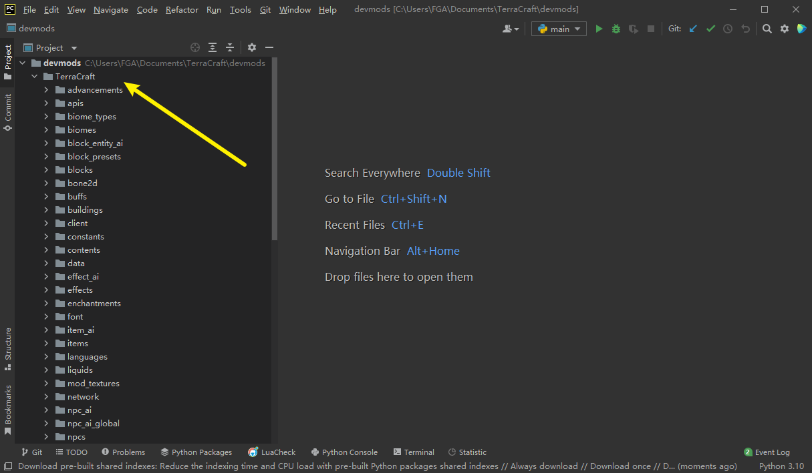

# 1.2 获取TerraCraft源码

## 通过Github下载
TerraCraft模组源代码仓库地址：https://github.com/skyblueyoshi/TerraCraft

浏览器打开源代码仓库，在Github页面中，你可以通过Git下载源码，或者通过下载压缩包得到源码。这里介绍通过压缩包下载源码。

点击**Code->Download ZIP**，将源码以压缩包的形式下载。

将下载的源码ZIP解压到devmods文件夹下，并修改文件夹名称为TerraCraft。

请确保最终路径是正确的，也就是_devmods/Terracraft_目录下，正确存在_package.json_文件。

再次打开Pycharm，你将能正确查看和编辑游戏源代码，左侧Project视图将正确显示TerraCraft的源代码层级。

