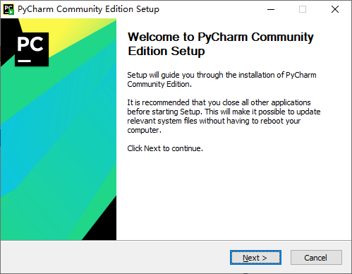
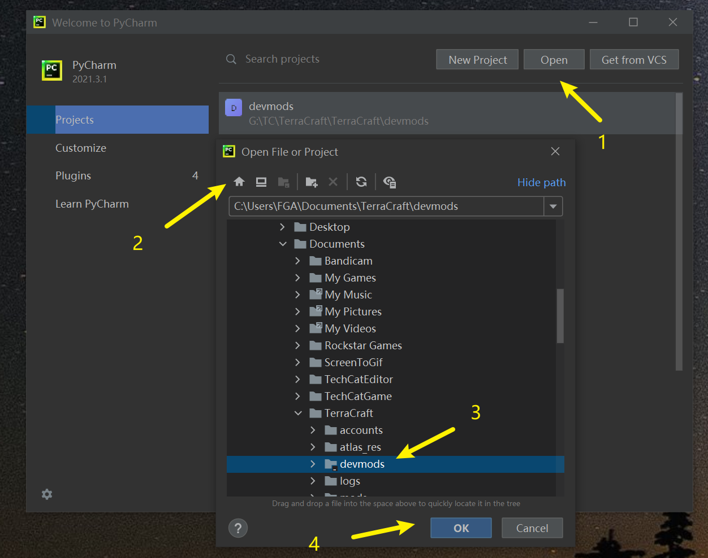
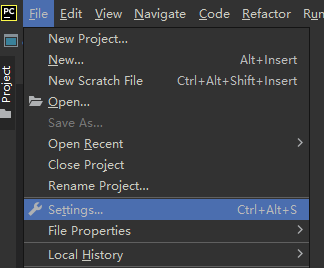
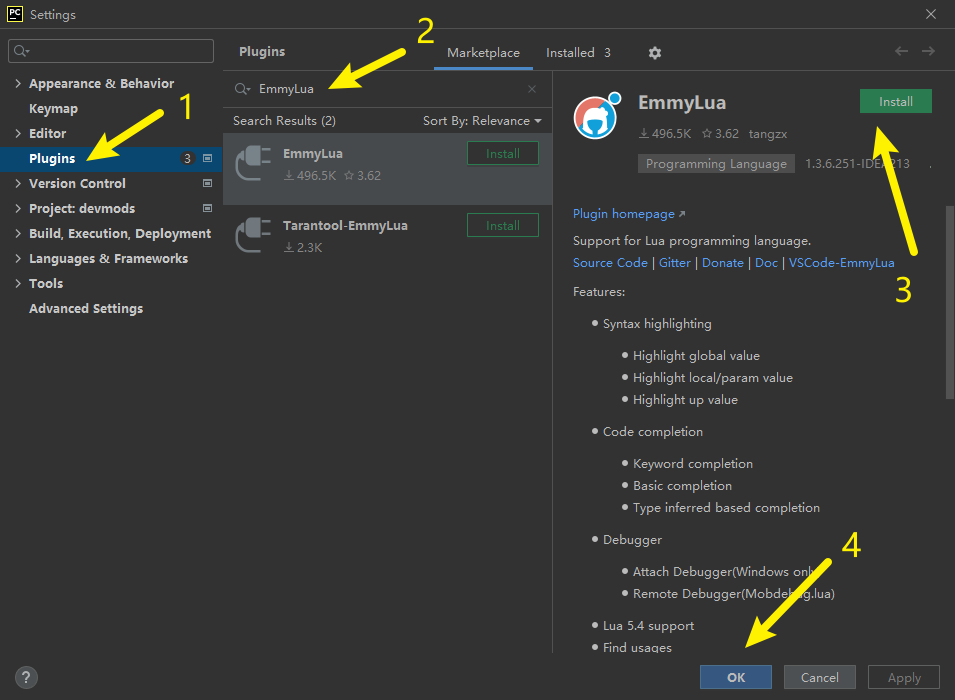
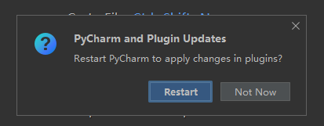

# 1.1 安装集成开发环境

本教程将使用Pycharm社区版作为主要集成开发环境。

## 安装Pycharm社区版
到Pycharm官网下载Pycharm社区版的最新版本：

https://www.jetbrains.com/pycharm/download/#section=windows

打开下载的安装包，跟着安装指引走，直至安装完成。

## 使用Pycharm打开模组开发目录

1. 安装完成Pycharm后，打开Pycharm，在**Welcome to Pycharm**界面中，点击**Open**按钮，弹出**Open File or Project**选项框。
2. 点击第一个**Home Directory**按钮，快速定位到用户文件夹。
3. 依次点击打开**Documents->TerraCraft->devmods**文件夹，选中**devmods**文件夹。
4. 点击**OK**按钮，确定打开。

正确打开后，左侧Project窗口将显示**devmods**的所有文件内容。

## 安装EmmyLua插件
由于游戏以及引擎的API使用了EmmyLua文档规范，您还需要为您的IDE安装EmmyLua插件。该插件提供自动补全，快速跳转、查找所有引用等实用功能。
依次从菜单栏点击**File->Settings...**，打开**Settings**窗口。

点击**Plugins**，在中间搜索栏中输入**EmmyLua**，搜索得到EmmyLua插件，点击**Install**。等待安装完成后，点击**OK**。

安装完成后，在弹出的弹窗中点击**Restart**，重启IDE让EmmyLua插件生效（如果没有弹窗，请手动重启）。

